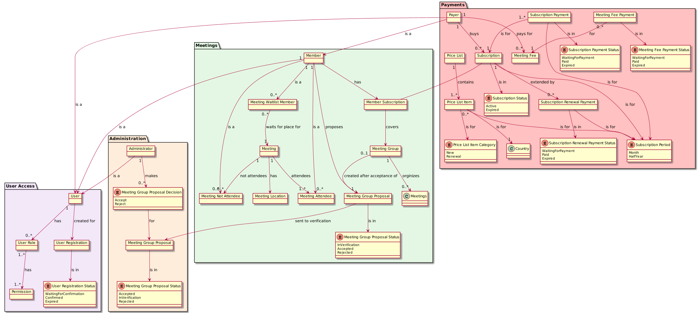
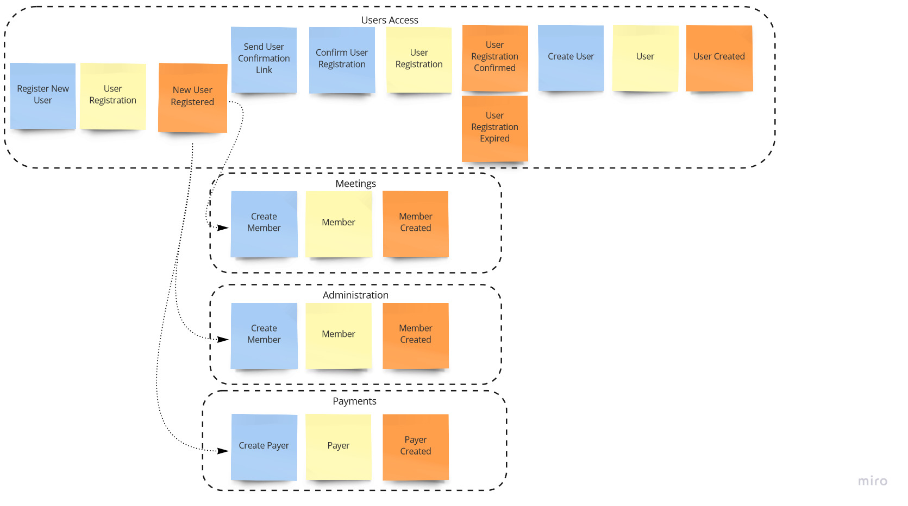
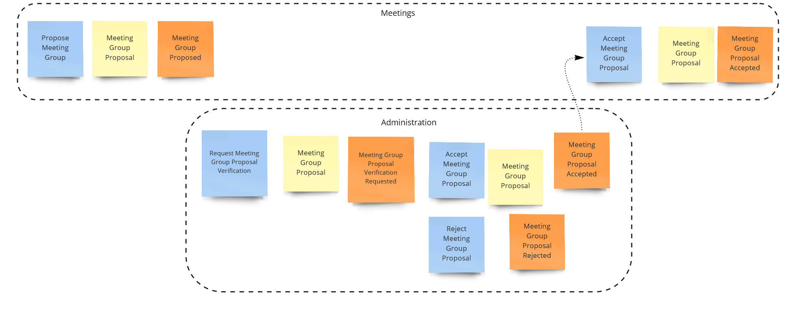
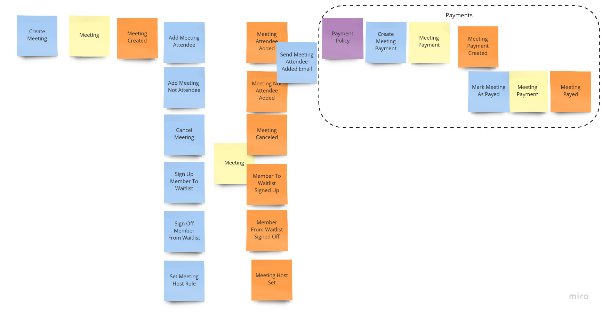
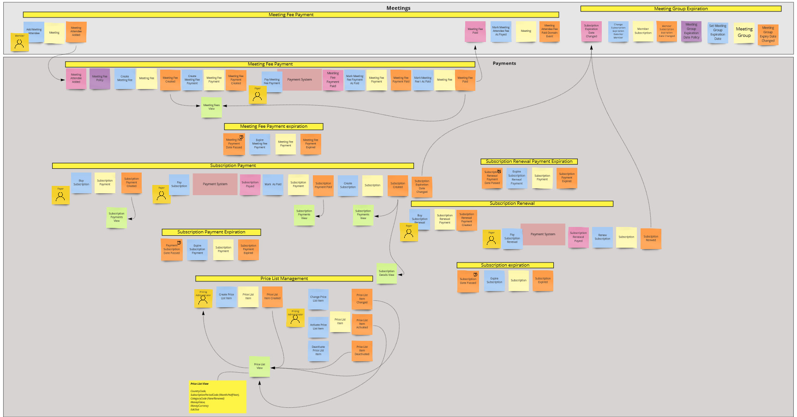
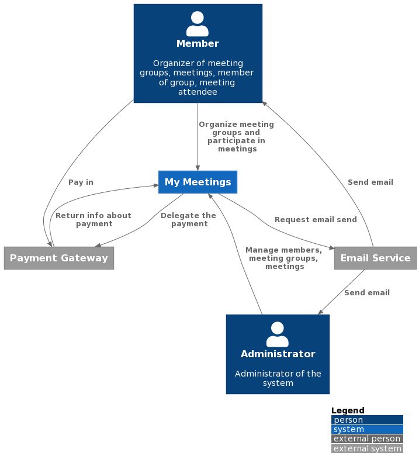
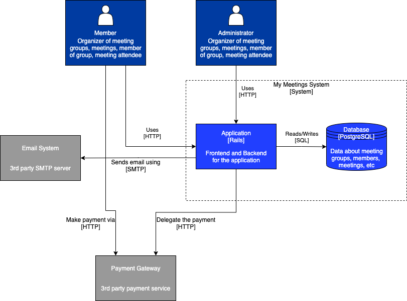
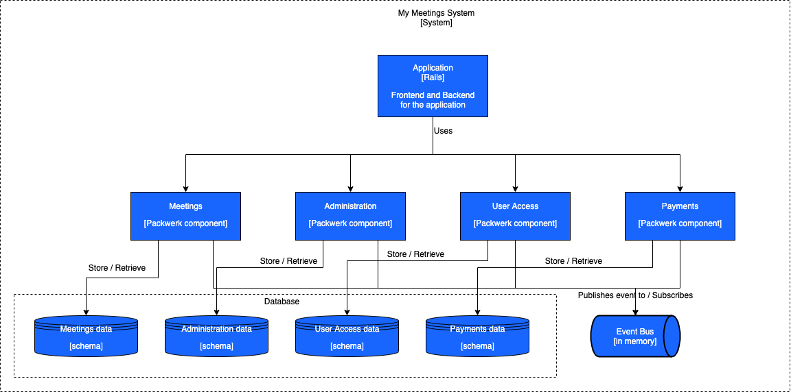
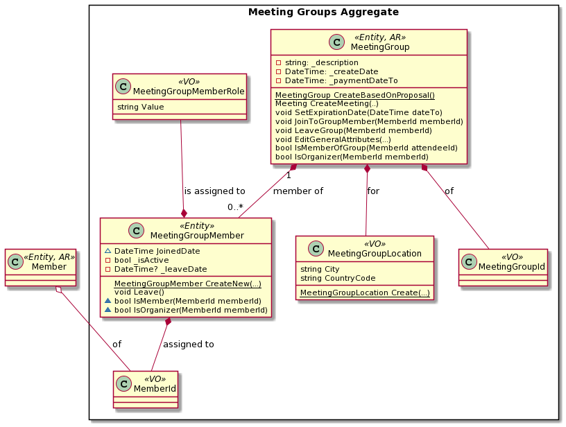

# Rails Modular Monolith with DDD

Full Modular Monolith Rails application with Domain-Driven Design approach. This is the Rails version of the [.NET application](https:/github.com/kgrzybek/modular-monolith-with-ddd).

## CI

## Table of contents

[1. Introduction](#1-Introduction)

&nbsp;&nbsp;[1.1 Purpose of this Repository](#11-purpose-of-this-repository)

&nbsp;&nbsp;[1.2 Out of Scope](#12-out-of-scope)

&nbsp;&nbsp;[1.3 Reason](#13-reason)

&nbsp;&nbsp;[1.4 Disclaimer](#14-disclaimer)

&nbsp;&nbsp;[1.5 Give a Star](#15-give-a-star)

&nbsp;&nbsp;[1.6 Share It](#16-share-it)

[2. Domain](#2-Domain)

&nbsp;&nbsp;[2.1 Description](#21-description)

&nbsp;&nbsp;[2.2 Conceptual Model](#22-conceptual-model)

&nbsp;&nbsp;[2.3 Event Storming](#23-event-storming)

[3. Architecture](#3-Architecture)

&nbsp;&nbsp;[3.0 C4 Model](#30-c4-model)

&nbsp;&nbsp;[3.1 High Level View](#31-high-level-view)

&nbsp;&nbsp;[3.2 Module Level View](#32-module-level-view)

&nbsp;&nbsp;[3.3 API and Module Communication](#33-api-and-module-communication)

&nbsp;&nbsp;[3.4 Module Requests Processing via CQRS](#34-module-requests-processing-via-cqrs)

&nbsp;&nbsp;[3.5 Domain Model Principles and Attributes](#35-domain-model-principles-and-attributes)

&nbsp;&nbsp;[3.6 Cross-Cutting Concerns](#36-cross-cutting-concerns)

&nbsp;&nbsp;[3.7 Modules Integration](#37-modules-integration)

&nbsp;&nbsp;[3.8 Internal Processing](#38-internal-processing)

&nbsp;&nbsp;[3.9 Security](#39-security)

&nbsp;&nbsp;[3.10 Unit Tests](#310-unit-tests)

&nbsp;&nbsp;[3.11 Architecture Decision Log](#311-architecture-decision-log)

&nbsp;&nbsp;[3.12 Architecture Unit Tests](#312-architecture-unit-tests)

&nbsp;&nbsp;[3.13 Integration Tests](#313-integration-tests)

&nbsp;&nbsp;[3.14 System Integration Testing](#314-system-integration-testing)

&nbsp;&nbsp;[3.15 Event Sourcing](#315-event-sourcing)

&nbsp;&nbsp;[3.16 Database change management](#316-database-change-management)

&nbsp;&nbsp;[3.17 Continuous Integration](#317-continuous-integration)

&nbsp;&nbsp;[3.18 Static code analysis](#318-static-code-analysis)

[4. Technology](#4-technology)

[5. How to Run](#5-how-to-run)

[6. Contribution](#6-contribution)

[7. Roadmap](#7-roadmap)

[8. Authors](#8-authors)

[9. License](#9-license)

[10. Inspirations and Recommendations](#10-inspirations-and-recommendations)

## 1. Introduction

### 1.1 Purpose of this Repository

This is a list of the main goals of this repository:

- Showing how you can implement a **monolith** application in a **modular** way
- Presentation of the **full implementation** of an application
  - This is not another simple application
  - This is not another proof of concept (PoC)
  - The goal is to present the implementation of an application that would be ready to run in production
- Showing the application of **best practices** and **object-oriented programming principles**
- Presentation of the use of **design patterns**. When, how and why they can be used
- Presentation of some **architectural** considerations, decisions, approaches
- Presentation of the implementation using **Domain-Driven Design** approach (**tactical** patterns)
- Presentation of the implementation of **Unit Tests** for Domain Model (Testable Design in mind)
- Presentation of the implementation of **Integration Tests**
- Presentation of the implementation of **Event Sourcing**
- Presentation of **C4 Model**
- Presentation of **diagram as text** approach

### 1.2 Out of Scope

This is a list of subjects which are out of scope for this repository:
- Business requirements gathering and analysis
- System analysis
- Domain exploration
- Domain distillation
- Domain-Driven Design **strategic** patterns
- Architecture evaluation, quality attributes analysis
- Integration, system tests
- Project management
- Infrastructure
- Containerization
- Software engineering process
- Deployment process
- Maintenance
- Documentation

### 1.3 Reason

The reason for creating this repository is the lack of something similar. Most sample applications on GitHub have at least one of the following issues:
- Very, very simple - few entities and use cases implemented
- Not finished (for example there is no authentication, logging, etc..)
- Poorly designed (in my opinion)
- Poorly implemented (in my opinion)
- Not well described
- Assumptions and decisions are not clearly explained
- Implements "Orders" domain - yes, everyone knows this domain, but something different is needed
- Implemented in old technology
- Not maintained

To sum up, there are some very good examples, but there are far too few of them. This repository has the task of filling this gap at some level.

### 1.4 Disclaimer

Software architecture should always be created to resolve specific **business problems**. Software architecture always supports some quality attributes and at the same time does not support others. A lot of other factors influence your software architecture - your team, opinions, preferences, experiences, technical constraints, time, budget, etc.

Always functional requirements, quality attributes, technical constraints and other factors should be considered before an architectural decision is made.

Because of the above, the architecture and implementation presented in this repository is **one of the many ways** to solve some problems. Take from this repository as much as you want, use it as you like but remember to **always pick the best solution which is appropriate to the problem class you have**.

### 1.5 Give a Star

My primary focus in this project is on quality. Creating a good quality product involves a lot of analysis, research and work. It takes a lot of time. If you like this project, learned something or you are using it in your applications, please give it a star :star:.  This is the best motivation for me to continue this work. Thanks!

### 1.6 Share It

There are very few really good examples of this type of application. If you think this repository makes a difference and is worth it, please share it with your friends and on social networks. I will be extremely grateful.

## 2. Domain

### 2.1 Description

**Definition:**

> Domain - A sphere of knowledge, influence, or activity. The subject area to which the user applies a program is the domain of the software. [Domain-Driven Design Reference](http://domainlanguage.com/ddd/reference/), Eric Evans

The **Meeting Groups** domain was selected for the purposes of this project based on the [Meetup.com](https://www.meetup.com/) system.

**Main reasons for selecting this domain:**

- It is common, a lot of people use the Meetup site to organize or attend meetings
- There is a system for it, so everyone can check this implementation against a working site which supports this domain
- It is not complex so it is easy to understand
- It is not trivial - there are some business rules and logic and it is not just CRUD operations
- You don't need much specific domain knowledge unlike other domains like financing, banking, medical
- It is not big so it is easier to implement

**Meetings**

The main business entities are `Member`, `Meeting Group` and `Meeting`. A `Member` can create a `Meeting Group`, be part of a `Meeting Group` or can attend a `Meeting`.

A `Meeting Group Member` can be an `Organizer` of this group or a normal `Member`.

Only an `Organizer` of a `Meeting Group` can create a new `Meeting`.

A `Meeting` has attendees, not attendees (`Members` which declare they will not attend the `Meeting`) and `Members` on the `Waitlist`.

A `Meeting` can have an attendee limit. If the limit is reached, `Members` can only sign up to the `Waitlist`.

A `Meeting Attendee` can bring guests to the `Meeting`. The number of guests allowed is an attribute of the `Meeting`. Bringing guests can be unallowed.

A `Meeting Attendee` can have one of two roles: `Attendee` or `Host`. A `Meeting` must have at least one `Host`. The `Host` is a special role which grants permission to edit `Meeting` information or change the attendees list.

A `Member` can comment `Meetings`. A `Member` can reply to, like other `Comments`. `Organizer` manages commenting of `Meeting` by `Meeting Commenting Configuration`. `Organizer` can delete any `Comment`.

Each `Meeting Group` must have an organizer with active `Subscription`. One organizer can cover 3 `Meeting Groups` by his `Subscription`.

Additionally, Meeting organizer can set an `Event Fee`. Each `Meeting Attendee` is obliged to pay the fee. All guests should be paid by `Meeting Attendee` too.

**Administration**

To create a new `Meeting Group`, a `Member` needs to propose the group. A `Meeting Group Proposal` is sent to `Administrators`. An `Administrator` can accept or reject a `Meeting Group Proposal`. If a `Meeting Group Proposal` is accepted, a `Meeting Group` is created.

**Payments**

Each `Member` who is the `Payer` can buy the `Subscription`. He needs to pay the `Subscription Payment`. `Subscription` can expire so `Subscription Renewal` is required (by `Subscription Renewal Payment` payment to keep `Subscription` active).

When the `Meeting` fee is required, the `Payer` needs to pay `Meeting Fee` (through `Meeting Fee Payment`).

**Users**

Each `Administrator`, `Member` and `Payer` is a `User`. To be a `User`, `User Registration` is required and confirmed.

Each `User` is assigned one or more `User Role`.

Each `User Role` has set of `Permissions`. A `Permission` defines whether `User` can invoke a particular action.

### 2.2 Conceptual Model

**Definition:**

> Conceptual Model - A conceptual model is a representation of a system, made of the composition of concepts that are used to help people know, understand, or simulate a subject the model represents. [Wikipedia - Conceptual model](https://en.wikipedia.org/wiki/Conceptual_model)

**Conceptual Model**

PlantUML version:

VisualParadigm version (not maintained, only for demonstration):

**Conceptual Model of commenting feature**

### 2.3 Event Storming

While a Conceptual Model focuses on structures and relationships between them, **behavior** and **events** that occur in our domain are more important.

There are many ways to show behavior and events. One of them is a light technique called [Event Storming](https://www.eventstorming.com/) which is becoming more popular. Below are presented 3 main business processes using this technique: user registration, meeting group creation and meeting organization.

Note: Event Storming is a light, live workshop. One of the possible outputs of this workshop is presented here. Even if you are not doing Event Storming workshops, this type of process presentation can be very valuable to you and your stakeholders.

**User Registration process**

------

------

**Meeting Group creation**

------

**Meeting organization**

------

**Payments**

[Download high resolution file](docs/images/payments-eventstorming-design-highres.jpeg)

------

## 3. Architecture

### 3.0 C4 Model

[C4 model](https://c4model.com/) is a lean graphical notation technique for modelling the architecture of software systems.  

As can be found on the website of the author of this model ([Simon Brown](https://simonbrown.je/)): *The C4 model was created as a way to help software development teams describe and communicate software architecture, both during up-front design sessions and when retrospectively documenting an existing codebase*  

*Model C4* defines 4 levels (views) of the system architecture: *System Context*, *Container*, *Component* and *Code*. Below are examples of each of these levels that describe the architecture of this system.  

*Note: The [PlantUML](https://plantuml.com/) (diagram as text) component was used to describe all C4 model levels. Additionally, for levels C1-C3, a [C4-PlantUML](https://github.com/plantuml-stdlib/C4-PlantUML) plug-in connecting PlantUML with the C4 model was used*.

#### 3.0.1 C1 System Context

#### 3.0.2 C2 Container

#### 3.0.3 C3 Component (high-level)

#### 3.0.4 C3 Component (module-level)

TBD

#### 3.0.5 C4 Code (meeting group aggregate)

### 3.1 High Level View

TBD

### 3.2 Module Level View

TBD

### 3.3 API and Module Communication

TBD

### 3.4 Module Requests Processing via CQRS

TBD

### 3.5 Domain Model Principles and Attributes

TBD

### 3.6 Cross-Cutting Concerns

TBD

### 3.7 Modules Integration

TBD

### 3.8 Internal Processing

TBD

### 3.9 Security

TBD

### 3.10 Unit Tests

TBD

### 3.11 Architecture Decision Log

TBD

### 3.12 Architecture Unit Tests

TBD

### 3.13 Integration Tests

TBD

### 3.14 System Integration Testing

TBD

### 3.15 Event Sourcing

TBD

### 3.16 Database change management

TBD

### 3.17 Continuous Integration

TBD

### 3.18 Static code analysis

TBD

## 4. Technology

List of technologies, frameworks and libraries used for implementation:

- [Ruby 3](https://www.ruby-lang.org/) (Programming Language)
- [Rails 7](https://rubyonrails.org/) (Web Framework)
- [PostgreSQL](https://www.postgresql.org/) (Database)
- [Puma](https://puma.io/) (Web Server)
- [Dart Sass](https://sass-lang.com/dart-sass) (CSS Extension Language)
- [Bootstrap](https://getbootstrap.com/) (CSS Framework)
- [esbuild](https://esbuild.github.io/) (JS Bundler)

## 5. How to Run

### Install Ruby 3.0
- Download and install Ruby 3.0 (e.g. with `ruby-install`)

### Install Bundler
- Install Bundler with `gem install bundler`

### Install dependencies
- Run `bundle install` to install dependencies

### Create database
- Install and start PostgreSQL
- Run `bundle exec rails db:create` to create the database
- Run `bundle exec rails db:migrate` to run the migrations

### Start the server
- Run `./bin/dev` to start the server

### Visit the app
- Go to `http://localhost:3000` on your browser to access the server

## 6. Contribution

This project is still under analysis and development. I assume its maintenance for a long time and I would appreciate your contribution to it. Please let me know by creating an Issue or Pull Request.

## 7. Roadmap

TBD

## 8. Authors

Original idea by: Kamil Grzybek

## 9. License

The project is under [MIT license](https://opensource.org/licenses/MIT).

## 10. Inspirations and Recommendations

### Modular Monolith
- ["Modular Monolith: A Primer"](https://www.kamilgrzybek.com/design/modular-monolith-primer/) Modular Monolith architecture article series, Kamil Grzybek
- ["Modular Monolith Architecture: One to rule them all"](https://www.youtube.com/watch?v=njDSXUWeik0) presentation, Kamil Grzybek
- ["Modular Monoliths"](https://www.youtube.com/watch?v=5OjqD-ow8GE) presentation, Simon Brown
- ["Majestic Modular Monoliths"](https://www.youtube.com/watch?v=BOvxJaklcr0) presentation, Axel Fontaine
- ["Building Better Monoliths – Modulithic Applications with Spring Boot"](https://speakerdeck.com/olivergierke/building-better-monoliths-modulithic-applications-with-spring-boot-cd16e6ec-d334-497d-b9f6-3f92d5db035a) slides, Oliver Drotbohm
- ["MonolithFirst"](https://martinfowler.com/bliki/MonolithFirst.html) article, Martin Fowler
- ["Pattern: Monolithic Architecture"](https://microservices.io/patterns/monolithic.html) pattern description, Chris Richardson

### Domain-Driven Design
- ["Domain-Driven Design: Tackling Complexity in the Heart of Software"](https://www.amazon.com/Domain-Driven-Design-Tackling-Complexity-Software/dp/0321125215) book, Eric Evans
- ["Implementing Domain-Driven Design"](https://www.amazon.com/Implementing-Domain-Driven-Design-Vaughn-Vernon/dp/0321834577) book, Vaughn Vernon
- ["Domain-Driven Design Distilled"](https://www.amazon.com/dp/0134434420) book, Vaughn Vernon
- ["Patterns, Principles, and Practices of Domain-Driven Design"](https://www.amazon.com/Patterns-Principles-Practices-Domain-Driven-Design-ebook/dp/B00XLYUA0W) book, Scott Millett, Nick Tune
- ["Secure By Design"](https://www.amazon.com/Secure-Design-Daniel-Deogun/dp/1617294357) book, Daniel Deogun, Dan Bergh Johnsson, Daniel Sawano
- ["Hands-On Domain-Driven Design with .NET Core: Tackling complexity in the heart of software by putting DDD principles into practice"](https://www.amazon.com/Hands-Domain-Driven-Design-NET-ebook/dp/B07C5WSR9B) book, Alexey Zimarev
- ["Domain Modeling Made Functional: Tackle Software Complexity with Domain-Driven Design and F#"](https://www.amazon.com/Domain-Modeling-Made-Functional-Domain-Driven-ebook/dp/B07B44BPFB) book, Scott Wlaschin
- ["DDD by examples - library"](https://github.com/ddd-by-examples/library) GH repository, Jakub Pilimon, Bartłomiej Słota
- ["IDDD_Samples"](https://github.com/VaughnVernon/IDDD_Samples) GH repository, Vaughn Vernon
- ["IDDD_Samples_NET"](https://github.com/VaughnVernon/IDDD_Samples_NET) GH repository, Vaughn Vernon
- ["Awesome Domain-Driven Design"](https://github.com/heynickc/awesome-ddd) GH repository, Nick Chamberlain

### Application Architecture
- ["Patterns of Enterprise Application Architecture"](https://martinfowler.com/books/eaa.html) book, Martin Fowler
- ["Dependency Injection Principles, Practices, and Patterns"](https://www.manning.com/books/dependency-injection-principles-practices-patterns) book, Steven van Deursen, Mark Seemann
- ["Clean Architecture: A Craftsman's Guide to Software Structure and Design (Robert C. Martin Series"](https://www.amazon.com/Clean-Architecture-Craftsmans-Software-Structure/dp/0134494164) book, Robert C. Martin
- ["The Clean Architecture"](https://blog.cleancoder.com/uncle-bob/2012/08/13/the-clean-architecture.html) article, Robert C. Martin
- ["The Onion Architecture"](https://jeffreypalermo.com/2008/07/the-onion-architecture-part-1/) article series, Jeffrey Palermo
- ["Hexagonal/Ports & Adapters Architecture"](https://web.archive.org/web/20180822100852/http://alistair.cockburn.us/Hexagonal+architecture) article, Alistair Cockburn
- ["DDD, Hexagonal, Onion, Clean, CQRS, … How I put it all together"](https://herbertograca.com/2017/11/16/explicit-architecture-01-ddd-hexagonal-onion-clean-cqrs-how-i-put-it-all-together/) article, Herberto Graca

### Software Architecture
- ["Software Architecture in Practice (3rd Edition)"](https://www.amazon.com/Software-Architecture-Practice-3rd-Engineering/dp/0321815734) book, Len Bass, Paul Clements, Rick Kazman
- ["Software Architecture for Developers Vol 1 & 2"](https://softwarearchitecturefordevelopers.com/) book, Simon Brown
- ["Just Enough Software Architecture: A Risk-Driven Approach"](https://www.amazon.com/Just-Enough-Software-Architecture-Risk-Driven/dp/0984618104) book, George H. Fairbanks
- ["Software Systems Architecture: Working With Stakeholders Using Viewpoints and Perspectives (2nd Edition)"](https://www.amazon.com/Software-Systems-Architecture-Stakeholders-Perspectives/dp/032171833X/) book, Nick Rozanski, Eóin Woods
- ["Design It!: From Programmer to Software Architect (The Pragmatic Programmers)"](https://www.amazon.com/Design-Programmer-Architect-Pragmatic-Programmers/dp/1680502093) book, Michael Keeling

### System Architecture
- ["Enterprise Integration Patterns : Designing, Building, and Deploying Messaging Solutions"](https://www.enterpriseintegrationpatterns.com/) book and catalogue, Gregor Hohpe, Bobby Woolf
- ["Designing Data-Intensive Applications: The Big Ideas Behind Reliable, Scalable, and Maintainable Systems "](https://www.amazon.com/Designing-Data-Intensive-Applications-Reliable-Maintainable/dp/1449373321) book, Martin Kleppman
- ["Building Evolutionary Architectures: Support Constant Change"](https://www.amazon.com/Building-Evolutionary-Architectures-Support-Constant/dp/1491986360) book, Neal Ford
- ["Building Microservices: Designing Fine-Grained Systems"](https://www.amazon.com/Building-Microservices-Designing-Fine-Grained-Systems/dp/1491950358) book, Sam Newman

### Design
- ["Refactoring: Improving the Design of Existing Code"](https://www.amazon.com/Refactoring-Improving-Design-Existing-Code/dp/0201485672) book, Martin Fowler, Kent Beck, John Brant, William Opdyke, Don Roberts
- ["Clean Code: A Handbook of Agile Software Craftsmanship"](https://www.amazon.com/Clean-Code-Handbook-Software-Craftsmanship/dp/0132350882) book, Robert C. Martin
- ["Agile Principles, Patterns, and Practices in C#"](https://www.amazon.com/Agile-Principles-Patterns-Practices-C/dp/0131857258) book, Robert C. Martin
- ["Applying UML and Patterns: An Introduction to Object-Oriented Analysis and Design and Iterative Development (3rd Edition)"](https://www.amazon.com/Applying-UML-Patterns-Introduction-Object-Oriented/dp/0131489062) book, Craig Larman
- ["Working Effectively with Legacy Code"](https://www.amazon.com/Working-Effectively-Legacy-Michael-Feathers/dp/0131177052) book, Michael Feathers
- ["Code Complete: A Practical Handbook of Software Construction, Second Edition"](https://www.amazon.com/Code-Complete-Practical-Handbook-Construction/dp/0735619670) book, Steve McConnell
- ["Design Patterns: Elements of Reusable Object-Oriented Software"](https://www.amazon.com/Design-Patterns-Elements-Reusable-Object-Oriented/dp/0201633612) book, Erich Gamma, Richard Helm, Ralph Johnson, John Vlissides

### Craftsmanship
- ["The Clean Coder: A Code of Conduct for Professional Programmers"](https://www.amazon.com/Clean-Coder-Conduct-Professional-Programmers/dp/0137081073) book, Robert C. Martin
- ["The Pragmatic Programmer: From Journeyman to Master"](https://www.amazon.com/Pragmatic-Programmer-Journeyman-Master/dp/020161622X) book, Andrew Hunt

### Testing
- ["The Art of Unit Testing: with examples in C#"](https://www.amazon.com/Art-Unit-Testing-examples/dp/1617290890) book, Roy Osherove
- ["Unit Test Your Architecture with ArchUnit"](https://blogs.oracle.com/javamagazine/unit-test-your-architecture-with-archunit) article, Jonas Havers
- ["Unit Testing Principles, Practices, and Patterns"](https://www.amazon.com/Unit-Testing-Principles-Practices-Patterns/dp/1617296279) book, Vladimir Khorikov
- ["Growing Object-Oriented Software, Guided by Tests"](https://www.amazon.com/Growing-Object-Oriented-Software-Guided-Tests/dp/0321503627) book, Steve Freeman, Nat Pryce

### UML
- ["UML Distilled: A Brief Guide to the Standard Object Modeling Language (3rd Edition)"](https://www.amazon.com/UML-Distilled-Standard-Modeling-Language/dp/0321193687) book, Martin Fowler

### Event Storming
- ["Introducing EventStorming"](https://leanpub.com/introducing_eventstorming) book, Alberto Brandolini
- ["Awesome EventStorming"](https://github.com/mariuszgil/awesome-eventstorming) GH repository, Mariusz Gil

### Event Sourcing

- ["Hands-On Domain-Driven Design with .NET Core: Tackling complexity in the heart of software by putting DDD principles into practice"](https://www.amazon.com/Hands-Domain-Driven-Design-NET-ebook/dp/B07C5WSR9B) book, Alexey Zimarev
- ["Versioning in an Event Sourced System"](https://leanpub.com/esversioning) book, Greg Young
- [Hands-On-Domain-Driven-Design-with-.NET-Core](https://github.com/PacktPublishing/Hands-On-Domain-Driven-Design-with-.NET-Core) GH repository, Alexey Zimarev
- [EventSourcing.NetCore](https://github.com/oskardudycz/EventSourcing.NetCore) GH repository, Oskar Dudycz

